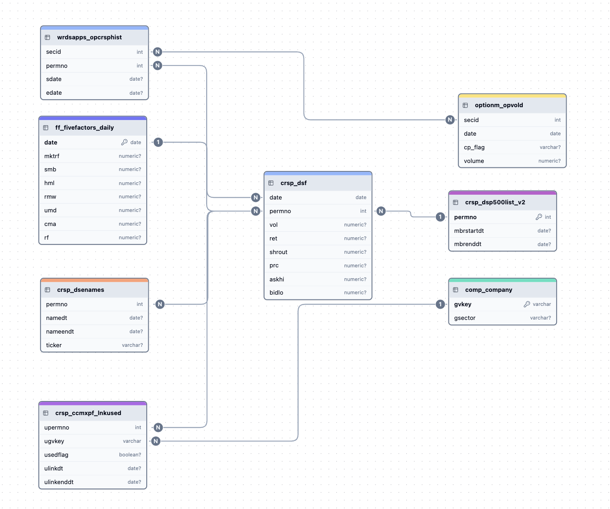

## WRDS database set-up
**Great resources to get started/ refer**:
- [Retrieving historical members S&P500](https://library.smu.edu.sg/topics-insights/notes-and-thoughts-retrieving-historical-members-sp-500-wrds)
- 
**Steps**
- Create a .pgpass file to store username and password
- pip install wrds
- Establish connection via `wrds.Connection()`
- The easiest way to look at the data is to go to WRDS SAS Studio.
- Get the variable schema of any table on SAS studio: 
```sql 
proc contents data= crsp.dsf;
run
```
## Database Schema


- Sentiment file: Provide link here 
**Notes:**
- As of July 202, Compustat no longer has S&P Dow Jones Indices. Access it through CRSP.
- For data after February 2025, you will need to change the data tables to their "*_V2" counterpart.

## License and Usage
© Minh Quang Ngo 2025. All rights reserved.

This repository is provided for viewing and discussion purposes only. No license is granted for reuse, reproduction, or distribution of the code contained herein. Contact the author for permission regarding any use outside of this repository.